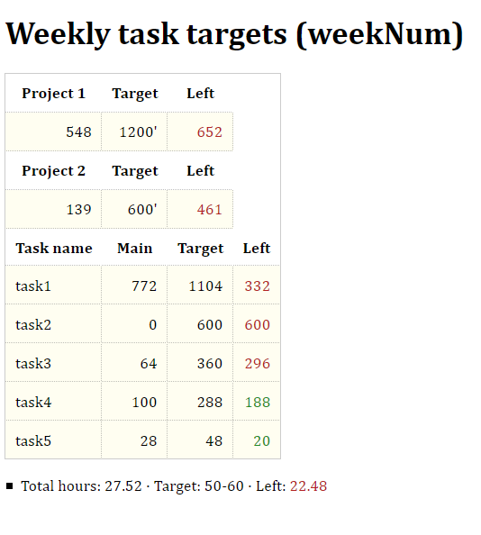

# Clockify target

Script to get current task times form specific Clockify project and compare task entries to weekly targets giving pertinent feedback/output.

## Background

The purpose of this repo is to create a page giving real-time feedback on projects tracked on a specific tool (Clockify). This projects are based on specific custom(personal) tasks and targets but, as much as possible, it'll be general-purpose oriented to ease its use.

## Targets vs time-tracked

All this script does is to fetch the data using Clockify's API from current's week projects and compare the time tracked with current targets (task targets on the _Main_ project depend on the amount of time tracked on another project, which has a higher priority).
The result is the calculation and output of current status for all projects and tasks (target achieved/not achieved and ETA).

## Files and data

_clockifyTargets.html_ will show the results, _script.js_ does the api call, calculations and outputs and _creds.js_ holds the API credentials (not recommended; currently trying to implement .env or similar approach), targets and output colors.

Sample output:

_Refs_:
 - [Clockify API documentation](https://clockify.me/developers-apihttps://clockify.me/developers-api)

